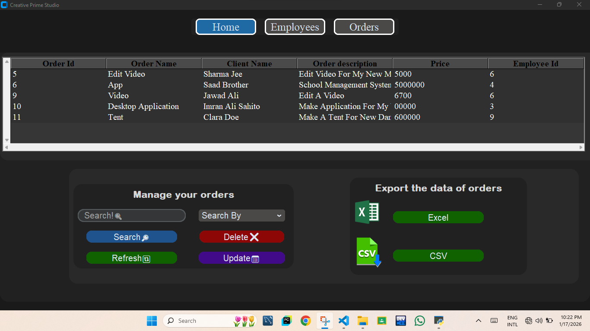
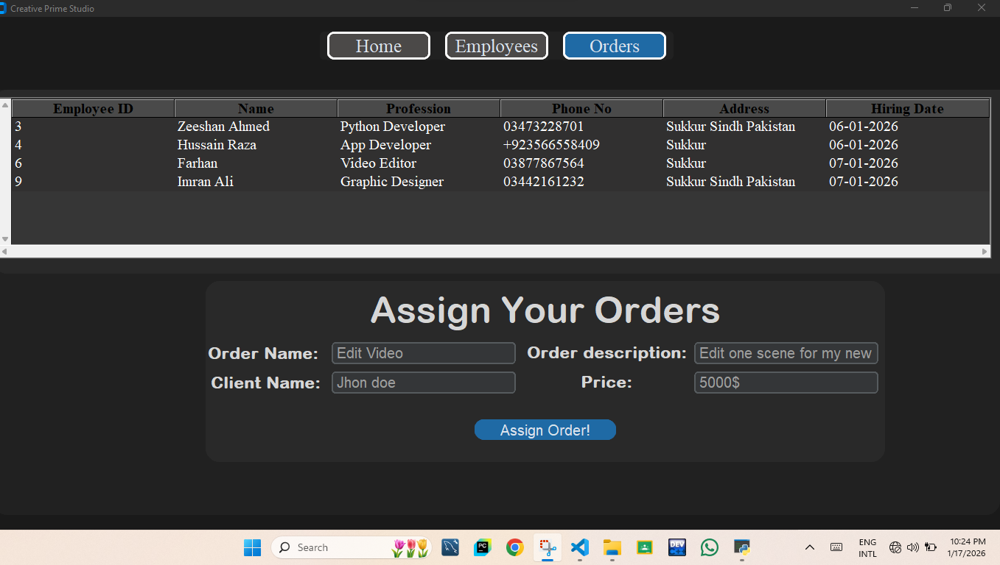

---

# 🎨 **Creative Prime Studio Management System**

A **Python-based Desktop Application** built using **Tkinter & CustomTkinter** to manage **employees, hiring & firing processes, and order/task assignments** for Creative Prime Studio.  
The system uses **MySQL** for secure data storage and supports structured management of studio operations.

---

## ✅ **Features**

### 👥 **Employee Management**

* Add, update, and manage employee records
* Store employee personal and professional details
* Hiring and firing system with database persistence

### 📦 **Order Management**

* Create and manage client orders
* Assign orders to employees
* Track order allocation and status

### 🗄️ **Database-Driven System**

* MySQL used for permanent data storage
* Secure database connection module
* Structured tables for employees and orders

### 🖥 **Modern CustomTkinter GUI**

* Built with **CustomTkinter** for a modern UI
* User-friendly forms and dialogs
* Message boxes for alerts and confirmations
* Clean and organized multi-window layout

### 📊 **Data Handling & Export**

* Data processing using **Pandas**
* Excel file support using **openpyxl**
* Image handling with **Pillow (PIL)**

---

## 🛠 **Technologies Used**

* **Python**
* **Tkinter & CustomTkinter (GUI)**
* **MySQL (Database)**
* **Pandas (Data Handling)**
* **Pillow (Image Processing)**
* **openpyxl (Excel Support)**

---

## 🚀 **How to Run the Creative Prime Studio Management System**

Follow these steps to properly set up and run the application.

---

## **1️⃣ Create the MySQL Database**

Open **MySQL Workbench** and run:

```sql
CREATE DATABASE creative_prime_studio;
```
---


## **2️⃣ Create Required Table**

After creating the database, run this SQL command to create the tables:

```sql
CREATE TABLE employees (
    Id INT AUTO_INCREMENT PRIMARY KEY,
    Name VARCHAR(100),
    Skill VARCHAR(100),
    Phone VARCHAR(50),
    Address VARCHAR(255),
    Hire_date VARCHAR(50)
);
CREATE TABLE orders (
    Id INT AUTO_INCREMENT PRIMARY KEY,
    order_Name VARCHAR(100),
    client_Name VARCHAR(100),
    order_des VARCHAR(255),
    price INT,
    assign_id INT
);

```

---

## **3️⃣ Connect Your MySQL Database to the App**

In your project, open your main.py

Update your credentials:

```python
import mysql.connector

db = mysql.connector.connect(
    host="localhost",
    user="root",
    password="YOUR_PASSWORD",
    database="academy_management"
)
```


---

## **4️⃣ Install Required Python Libraries**

Run these commands in terminal:

```bash
pip install customtkinter
pip install pillow
pip install pandas
pip install mysql-connector-python
```

---

## **5️⃣ Run the Application**

After installing the requirements, run:

```bash
main.py

```


---

## 📌 Future Improvements

* 🔐 **Authentication & Authorization**
  - Admin and employee login system
  - Role-based access (Admin / Manager / Employee)

* 📊 **Order Status Tracking**
  - Track order progress (Pending, In Progress, Completed)
  - Delivery date and priority management

* 👥 **Employee Performance Monitoring**
  - Track completed orders per employee
  - Performance reports and summaries

* 📄 **Report Generation**
  - Generate employee and order reports
  - Export reports to **Excel (CSV/XLSX)** and **PDF**

* 🔔 **Notifications & Alerts**
  - Alerts for new order assignments
  - Notifications for deadlines and updates

* 🌐 **Web-Based Version (Django)**
  - Convert desktop app to a Django web application
  - REST API for frontend or mobile app
  - High scalability and cloud deployment

* 🗃️ **Database Enhancements**
  - Add foreign key constraints
  - Improve normalization and indexing
  - Backup & recovery system

* 📱 **Responsive UI Improvements**
  - Improved UI/UX design
  - Dashboard with charts and statistics

* ☁️ **Cloud Deployment**
  - Host application on cloud servers
  - Use managed databases (AWS RDS / Railway / PlanetScale)

* 📦 **Inventory & Resource Management**
  - Manage studio resources and tools
  - Assign resources to orders

---


## 📸 Project Screenshots

### 🏫 Home Tab


### 👨‍🎓 Admission Form


### 🪟 View Tab


---
## 🤝 **Contributions**

Contributions, issues, and feature requests are welcome!
Feel free to open an issue or submit a pull request.

